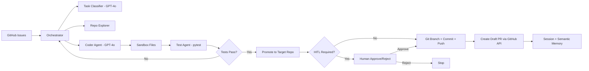

# CodePilot - Multi-Agent Coding Platform

CodePilot is a production-style autonomous coding agent.

It fetches real GitHub issues, classifies them with Azure OpenAI GPT-4o, explores the repo,
generates code fixes, runs tests in a sandbox, enforces human approval gates, creates a real
git branch and commit, and opens a real draft pull request.

## Goal

Build a practical multi-agent system that can resolve software tasks end-to-end with safety,
traceability, and human oversight.

## What Is Implemented

1. Multi-agent architecture
- `Orchestrator` coordinates task lifecycle and state transitions.
- `RepoExplorerAgent` maps repository and finds relevant files.
- `CoderAgent` generates structured edits with GPT-4o (LangChain structured output).
- `TestAgent` runs `pytest` in sandbox.
- `PRAgent` builds branch/title/body metadata for PR.

2. Real AI intelligence
- Azure OpenAI GPT-4o for task classification and code generation.
- Structured Pydantic outputs (`TaskClassification`, `LLMCoderOutput`) for predictable parsing.
- Rule-based fallback if LLM is unavailable.

3. Safety and control
- Sandbox-first file editing and testing.
- Guardrails for risky actions.
- Human-in-the-loop (HITL) approval before push/PR in high-risk scenarios.

4. Real DevOps automation
- Real git branch/commit/push on target repo via `GitHelper`.
- Real GitHub draft PR creation via REST API (`GitHubClient.create_pull_request`).
- PR labels are applied after PR creation, and reviewer requests are attempted for the issue reporter.

5. Memory and skills
- Episodic memory: session event log in the CodePilot app workspace (`.codepilot/session_log.json`).
- Semantic memory: lessons are backed by ChromaDB under `REPO_ROOT/.codepilot/semantic_chroma` with JSON backup in `lessons.json`.
- Skills catalog mapped to task types (`bug_fix`, `feature_addition`, etc.).

6. Operator UI
- Textual 4-panel TUI with live event updates.
- Manual task entry (`I`), skip issue (`S`), and HITL inspect view (`L`).
- CLI mode for straightforward JSON output.

## Verified End-to-End Result

Validated run output included:
- `fix_source: llm`
- `hitl_required: true`
- `hitl_approved: true`
- `git_pushed: true`
- `pr_number: 2`
- `pr_url: https://github.com/kirankumarkaturi/kiran-lab2/pull/2`

This confirms full autonomous flow from issue intake to real PR creation.

## Architecture Overview



## Project Structure

```text
src/codepilot/
  agents/
    coder.py
    pr_agent.py
    repo_explorer.py
    test_agent.py
  memory/
    session_store.py
    semantic_store.py
  skills/
    catalog.py
  tui/
    app.py
  config.py
  git_helper.py
  github_client.py
  guardrails.py
  orchestrator.py
  main.py
```

## Prerequisites

- Python 3.12+
- Git installed and authenticated for target repo push access
- GitHub personal access token with repo permissions
- Azure OpenAI deployment (GPT-4o)

## Configuration

Create `.env` in project root with:

```env
GITHUB_REPO_OWNER=your-owner
GITHUB_REPO_NAME=your-repo
GITHUB_TOKEN=your-token

AZURE_OPENAI_ENDPOINT=https://your-resource.openai.azure.com/
AZURE_OPENAI_API_KEY=your-key
AZURE_OPENAI_DEPLOYMENT=gpt-4o
AZURE_OPENAI_API_VERSION=2024-12-01-preview

POLL_INTERVAL_SECONDS=300
REPO_ROOT=C:/path/to/target-repo
SANDBOX_ROOT=./sandbox
MAX_COMPLEXITY=6
REPO_MAP_TOKEN_BUDGET=4000
REPO_MAP_TOP_K=10
REPO_RETRIEVAL_STRATEGY=keyword
EMBEDDING_MODEL_NAME=all-MiniLM-L6-v2
USE_DRY_RUN=false
```

## Run

Install dependencies:

```powershell
pip install -r requirements.txt
```

Run CLI mode:

```powershell
python -m src.codepilot.main
```

Run live TUI mode:

```powershell
python -m src.codepilot.tui.app
```

TUI keys:
- `A` approve HITL request
- `R` reject HITL request
- `L` inspect pending PR draft in the approval panel
- `I` create a manual task not tied to GitHub
- `S` skip the current top issue for this session
- `Q` quit UI

## Pipeline Walkthrough

1. Fetch assignable open issue from GitHub.
2. Classify issue type (LLM with fallback).
3. Explore repo and select relevant files.
4. Build or reuse a cached repo map, then retrieve top-K files using keyword or embedding search.
5. Copy files into sandbox and generate edits via GPT-4o.
6. Run tests in sandbox.
7. If tests pass, promote files to target repo.
8. Evaluate HITL guardrail and wait for approval when required.
9. Create branch, commit, and push.
10. Create draft PR through GitHub REST API.
11. Persist session and semantic memory records.

## Retrieval and Memory Notes

- CodePilot keeps its own session log under the app workspace at `.codepilot/session_log.json`.
- Repo map cache is stored under `REPO_ROOT/.codepilot/repo_map_cache.json` and invalidated via git signature changes.
- Embedding retrieval stores its index under `REPO_ROOT/.codepilot/chroma`.
- Semantic lesson memory stores vectorized lessons under `REPO_ROOT/.codepilot/semantic_chroma`.
- Retrieval mode is surfaced at runtime as `keyword`, `embedding:all-MiniLM-L6-v2`, or explicit fallback reasons.

## Notes and Limitations

- DeepAgents and LangGraph toolkit abstractions are represented here by equivalent custom orchestration and storage code.
- Only `all-MiniLM-L6-v2` is currently supported as an explicit local embedding model name.
- Pydantic warning lines from LangChain structured output are non-blocking and do not affect results.

## Submission Artifacts To Add Before Final Submission

- TUI demo GIF: [artifacts/kiran-assignment.gif](artifacts/kiran-assignment.gif)
- Add a link or screenshot for at least one generated PR example.
- Record the required 5-7 minute demo video.
- Rename or mirror the public repository to `codepilot-agent` if your evaluator requires the exact repo name from the assignment.

## Submission Checklist

- Multi-agent design implemented and demonstrated.
- LLM-powered reasoning and code generation implemented.
- Safety guardrails and HITL approval implemented.
- Real sandbox testing and real GitHub PR flow validated.
- Documentation and execution instructions included.
